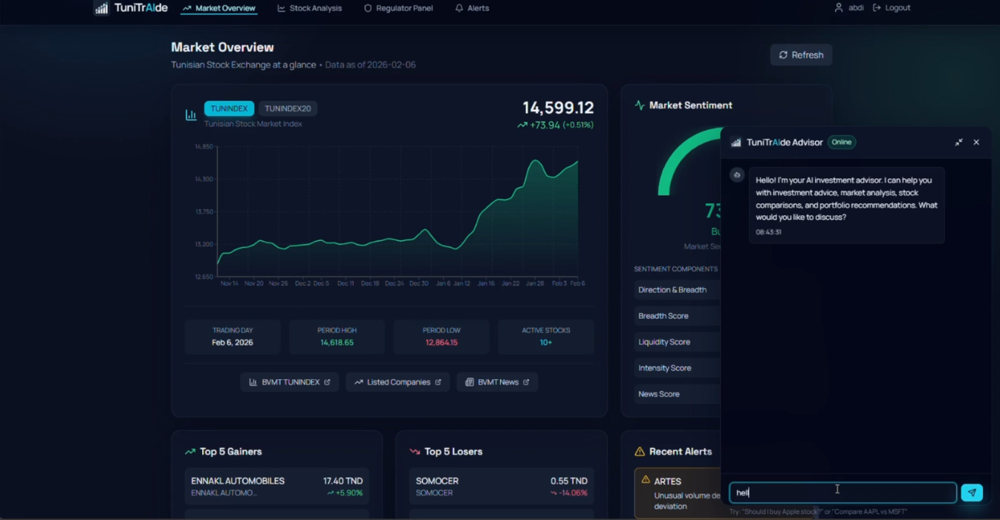

# IHEC-CODELAB 2.0 — Intelligent Trading Assistant (BVMT) 

## Context
The Tunis Stock Exchange (Bourse des Valeurs Mobilières de Tunis - BVMT) continues its modernization within a complex and volatile financial environment. Tunisian investors require intelligent, secure tools that comply with the regulatory framework (CMF). The market presents specific challenges: variable liquidity, multilingual information sources (French/Arabic), and the need for market manipulation monitoring.

## Problem Statement
Design an integrated **Intelligent Trading Assistant** combining:
- Price and liquidity forecasting,
- Market sentiment analysis,
- Anomaly detection,
- Decision agent and portfolio management.

## Main Objectives
- Assist investors in making informed decisions.
- Detect suspicious behavior in near real-time.
- Provide transparent explanations for recommendations.

## Core Features
### A. Price and Liquidity Forecasting (ML/Deep Learning)
- Predict short-term prices (1 to 5 days) for key BVMT stocks.
- Anticipate periods of low/high liquidity.
- Identify optimal entry and exit points.

### B. Sentiment Analysis (NLP)
- Collect and analyze Tunisian financial news.
- Classify sentiment (positive/negative/neutral) per stock.
- Correlate sentiment with price movements (optional).

### C. Anomaly Detection (Market Surveillance)
- Identify volume spikes and abnormal variations.
- Generate alerts to protect the investor.
- Detect potential market manipulations.

### D. Augmented Decision Agent (AI + Interface)
- Recommendations: Buy / Sell / Hold.
- Virtual portfolio simulation.
- Clear explainability of recommendations.
- Tracking and optimization of a multi-asset portfolio.

## Technical Specifications (Summary)
### Module 1 — Forecasting
**Objectives**
- Closing prices for the next 5 business days.
- Daily volume and probability of high/low liquidity.

**Expected Deliverables**
- Trained model with metrics (RMSE, MAE, Directional Accuracy).
- Forecast vs. Actual visualizations (including confidence intervals).
- Prediction API or Python function.
- Real-time pipeline (bonus).

### Module 2 — Sentiment
- Scraping of 3+ Tunisian news sources.
- Daily aggregated sentiment score per company.
- Multilingual support (French + Arabic).

### Module 3 — Anomalies
- Detection of:
  - Volume spikes (> 3σ).
  - Abnormal variations (> 5% within 1h without news).
  - Suspicious order patterns.
- Deliverables:
  - Precision/Recall/F1 metrics.
  - Alert interface and visualizations.

### Module 4 — Decision & Portfolio
- User Profile: Conservative / Moderate / Aggressive.
- Portfolio simulation (Virtual capital, ROI, Sharpe ratio, Max Drawdown).
- Mandatory Explainability.
- Reinforcement Learning (optional) or rule-based logic (minimum viable).

## User Interface (Dashboard)
**Required Pages**
1. **Market Overview**
   - Indices (TUNINDEX), top gainers/losers, global sentiment, alerts.
2. **Specific Stock Analysis**
   - History + 5-day forecasts, sentiment, RSI/MACD, recommendation.
3. **My Portfolio**
   - Positions, allocation, global performance, suggestions.
4. **Surveillance & Alerts**
   - Real-time anomaly feed, filters, history.

## Final Deliverables (Hackathon)
### Technical Deliverables
- Complete source code (GitHub/GitLab or ZIP).
- README with installation instructions.
- `requirements.txt` (Python) or `package.json` (Node).
- Functional application (local or hosted) with URL and credentials.
- Technical documentation: Architecture, model choices, metrics, limitations.
- Jupyter Notebooks (recommended): EDA, training, visualizations.

### Presentation Deliverables
- Pitch Deck (10–15 min).
- Demo Video (3–5 min).
- Complete User Journey.
- Use Case: "I want to invest 5,000 TND, what do you recommend?"

## Usage Scenarios (User Stories)
### 1) Beginner Investor
Ahmed (28 years old) obtains a "moderate" profile, receives a diversified portfolio and detailed explanations for each recommendation.

### 2) Experienced Trader
Leila (35 years old) receives anomaly alerts (abnormal volume), checks the news, and adjusts her strategy based on sentiment and volatility forecasts.

### 3) Regulator (CMF)
An inspector receives an alert regarding a suspicious variation and triggers an investigation based on the timeline of orders and anomalies.

---

**Project:** Intelligent Trading Assistant for BVMT — IHEC‑CODELAB 2.0
